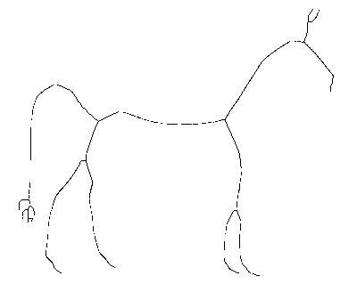

# skeletonide


Skeletonide is a parallel implementaion of Zhang-Suen morphological thinning
algorithm written in Halide-lang. It can be used for fast skeletonization of
binary masks. Can also be run on the GPU.

When you build the project, it generates an ahead-of-time compiled static
library from the Halide pipeline. It is then linked with the caller code to
generate a single binary.

Note: The Halide pipeline represents a single pass of the Zhang-Suen method. The
iterations have to be handled by the caller code - see `spook.cpp` for an
example. The number of iterations is hardcoded right now. It should depend on
the completion flags returned by the Halide pipeline.

## Usage

See `spook.cpp` for an example. The example benchmarks the time taken to
skeletonize a large image on the GPU. Pipeline code is in `src/pipeline.cpp`.

## Benchmarks

We get the best performance when it is run on a GPU. The tests are run on the
scikit-image's horse mask, but tiled 10x10 to create a large
(3280, 4000) shaped test image. The time is averaged over 100 runs.

| Implementation                        | CPU (i7-7700HQ) | GPU (GTX 1050m) |
| ------------------------------------- | --------------- | --------------- |
| Scikit-image `morphology.skeletonize` | **2073 ms**     | NA              |
| Skeletonide                           | 3786 ms         | **210 ms**      |

The scheduling of the Halide pipeline can be further tweaked through
trial-and-error to achieve better CPU times. The slow performance on the CPU is
partly explained by the fact that the pipeline only represents a single pass of
the thinning algorithm. There is significant time penalty in handling the
iterations from the outside as illustrated in `spook.cpp`.  
However, on the GPU, Skeletonide performs roughly 10x faster than the
scikit-image's CPU implemetation without major modifications. Not a level
playing field, obviously.

The output on the scikit-image's horse mask:

Mask:  


Skeleton:  


## Build

```sh
$ cmake -S . -B build
$ cmake --build build
# this will build the static library and its 
# header in `build/` and a single test binary 
# called `spook` in `skeletonide` - which can
# be run `./spook` to see it in action.
```

## License

MIT License
